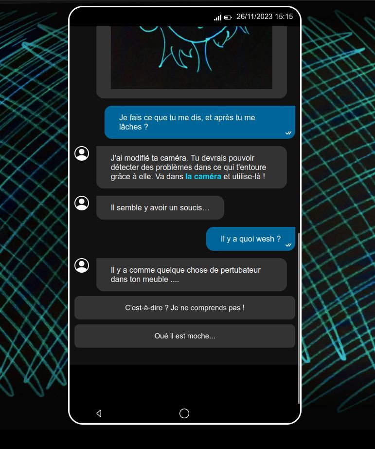
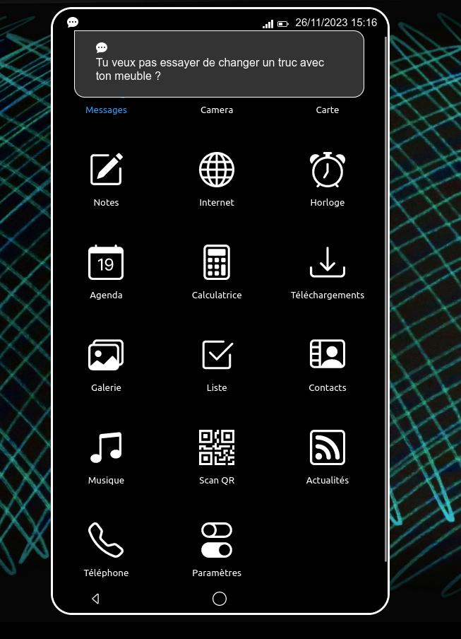
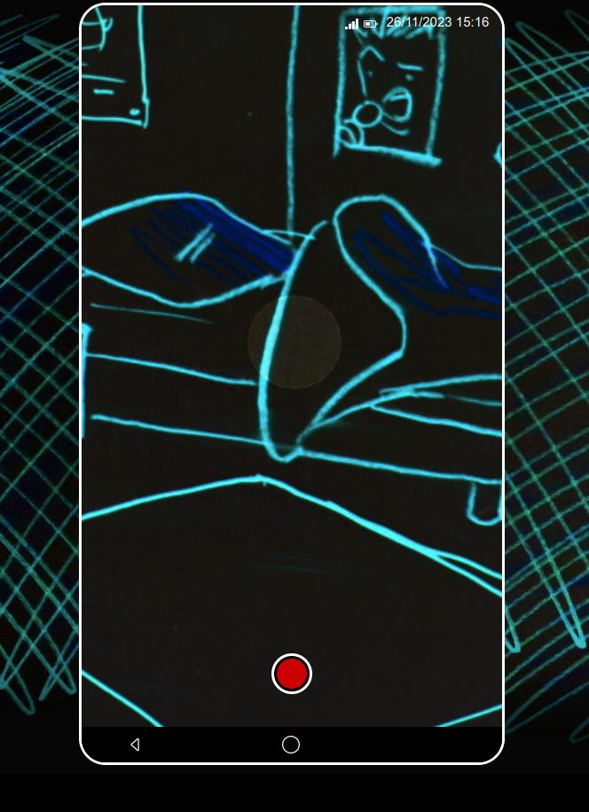

# Ludi'Health `Futures perturbations` : "Perturbateurs endocriniens" (Proof of concept)

A two days project made during the second edition of the LudiHealth game-jam. This is a proof of concept for a video game that would encourage teenagers to get informations about endocrine disruptors.

Synopsis: A futur version of the player is sick and hacks player's phone to communicate with the past and revert bad habits to improve their health.

## TRY IT ! 

DEMO : https://statics.nacq.me/ludihealth-pe/

## Screenshots

## Getting started

This project can be open in a modern browser without any installation step.

## TODO

 - goto fullscreen on start
 - Triggers on scenes 2 to 4
 - Dialogs reviews for scenes 2 to 4
 - Dialogs improvements
 - Visual ending and end credits
 - dialogs for fake applications
 - better Artwork
 - keyboard shortcuts
 - fake app for informations and/or settings
 - Browser compat checks
 - sub story with the girl friend (choices that can make our future self safe AND happy)

## Contributing

Report an issue or make a pull request. We would appreciate ! If you do something with this project, feel free to contact us. We may add your project in the related projects section.

## License

 - This source code is licensed under the GPLv3 - see the [LICENSE](LICENSE) file for details.

In `dialogs.json`

 - Dialogs from  Ophélie, Lucie, Iris. Rewiewed by [Nicolas NACQ](https://nico.nacq.me)

In `assets/drawings`

 - Artwork: CC-BY @Nicolas NACQ

In `assets/Guillaume_Cottez_Original_Soundtrack`

 - Music: CC-BY @Guillaume COTTEZ 

In `assets/`

 - CC-0 Audio assets from https://freesound.org/ 
 - Free usage images from [Pixabay](https://pixabay.com/)

In `index.html` 

 - class `.bi`, icons from https://icons.getbootstrap.com/

Intro font JGS is from [Adel Faure](https://adelfaure.net/tools/jgs/)

## Contributors

- [Nicolas NACQ](https://nico.nacq.me) (App & Artworks)
- Geoffroy, Ophélie, Lucie, Iris (dialogs, ideas)
- Guillaume COTTEZ (Music)

## Related resources
- https://www.ludihealth.org/
- [Saxonaute](https://gitea.nacq.me/nicolas/ludihealth-efr-poc): the project developped during the first edition of this event
- https://en.wikipedia.org/wiki/Endocrine_disruptor